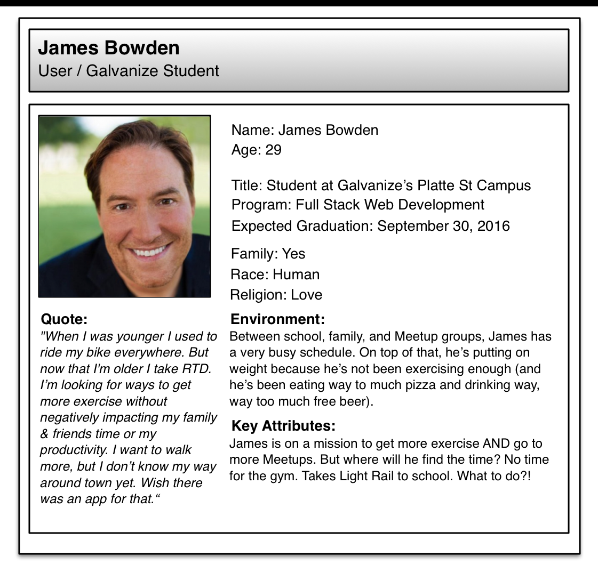
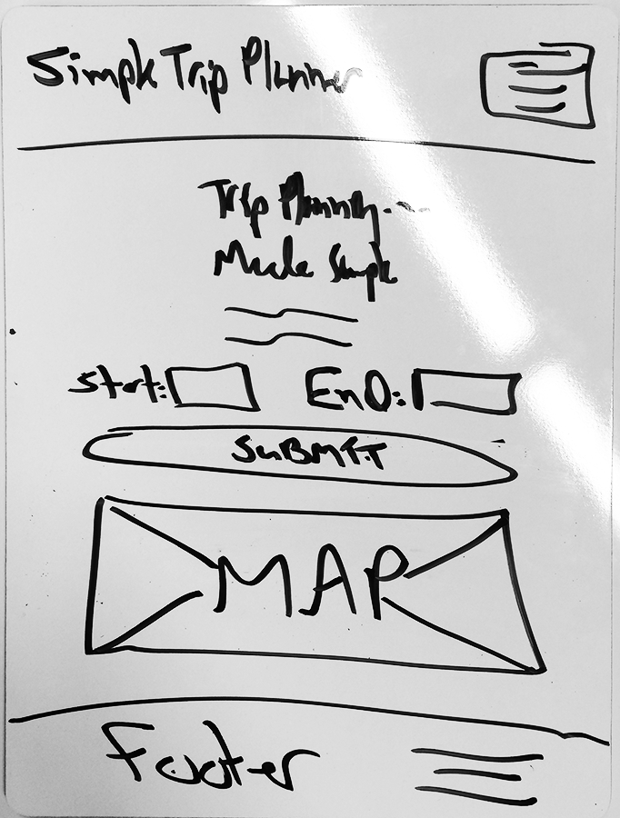

# Personal Project 1 - Galvanize Trip Planner App

* This is our first personal project as part of the Galvanize Full Stack program.
* The purpose is to give us a chance to practice some of the thing we've learned over our first four weeks, which introduced us to HTML, CSS, JavaScript, jQuery, APIs, design, UX, Bootstrap, and agile software development with Scrum.
* The app lives at http://pp1-trip-planner.firebaseapp.com
* A screencast demo is here: https://youtu.be/ungJ0ZAjFC0

## Project Proposal

An app to help Galvanize students in Denver find their way (walking only, for now) to/from campus and some Meetups of interest.

### Who Uses It?

* Galvanize students (especially new ones).
* Anyone else interested in walking directions to/from Galvanize's Denver locations and the Meetups listed.

### What Outputs Do They Need?

Directions from Point A to Point B.

### What Inputs Are Needed to Generate Those Outputs?

Valid starting points and ending points.

### What Technologies Do You Plan to Use?

* HTML5
* CSS3
* Bootstrap (and Bootstrap theme)
* JavaScript
* jQuery
* Google Maps API
* Firebase
* Git and Github
* Goole Docs Spreadsheet ([this one](https://docs.google.com/spreadsheets/d/1MmZROtcJNQnDB1Oi2CDSrSFqNNV5h-Xp0_LsgLMGj3k/edit#gid=0))
* tabletop (Node.js package)

### Feature List

* EPIC: User selects his or her starting point and ending point and see results displayed on map
* More features are planned (see Pivotal Tracker link, below)

### Process

* Use agile software development with Scrum (daily sprints)
* Write User Stories for a Persona (see below)
* Manage User Stories with [Pivotal Tracker](https://www.pivotaltracker.com/n/projects/1590193)
* Practice a solid Git workflow (branches, etc.)

### Persona

### Wireframe

### Post Project Links

* [Retrospective](https://docs.google.com/document/d/1GEft_6VCFKWe24gKFD-i0IF9WNi2pnvx2pyDs9BKNdw/edit?usp=sharing)
* [Write-up](https://docs.google.com/document/d/1NLvDD_ZkjP2xq_XnjAuL6IGbQ3jqbbuEa5rRV9mOB4Y/edit?usp=sharing)
* [Screencast](https://youtu.be/ungJ0ZAjFC0)
* [Initial Project Proposal (before pivot)](https://github.com/chrisco/individual-project-proposals)
