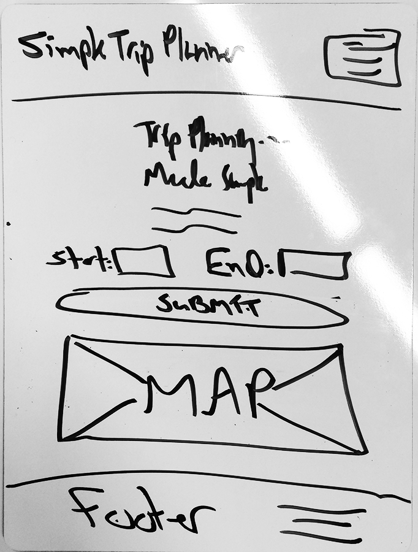

# Personal Project 1 - Simple Trip Planner App

* This is our first personal project as part of the Galvanize Full Stack program.
* The purpose is to give us a chance to practice some of the thing we've learned over our first four weeks, which introduced us to HTML, CSS, JavaScript, jQuery, APIs, design, UX, Bootstrap, and agile software development with Scrum.
* The app lives at https://pp1-trip-planner.firebaseapp.com/

## Project Proposal

App to help new Galvanize students find their way to and from Meetups and other points of interest, get to know Denver, and get more exercise all at the same time.

### Who Uses It?

Galvanize students (especially new ones).

### What Outputs Do They Need?

Directions from Point A to Point B.

### What Inputs Are Needed to Generate Those Outputs?

Valid starting point and ending point.

### What Technologies Do You Plan to Use?

* HTML5
* CSS3
* SAAS (maybe)
* A CSS framework, such as Bootstrap or Foundation
* JavaScript
* A JavaScript testing framework (stretch)
* jQuery
* The Google Maps API (and possibly other APIs)
* Firebase
* Git and Github
* A continuous integration server (stretch)

### Feature List

* EPIC: Users submit their starting point and ending point and get results.
* More features are planned.

### Process

* Use agile software development with Scrum
* Write User Stories for a Persona (see below)
* Manage User Stories with [Pivotal Tracker](https://www.pivotaltracker.com/n/projects/1590193)
* Practice a solid Git workflow (branches, etc.)

### Persona

### Wireframe

